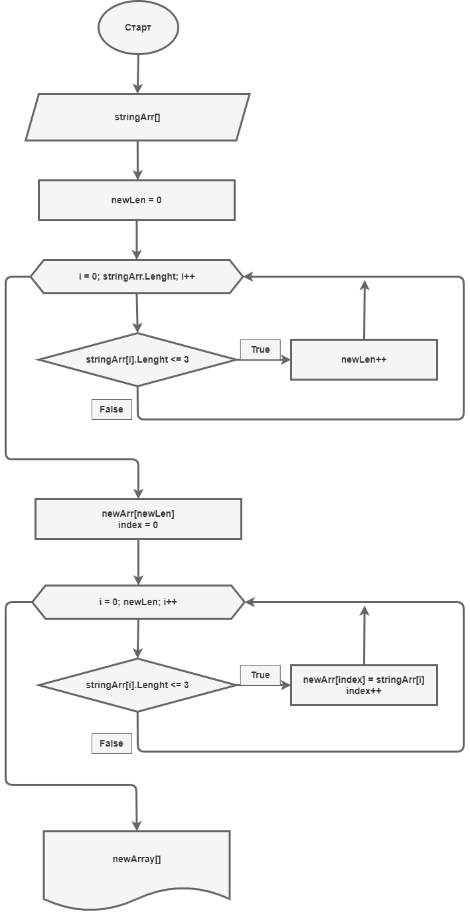

# Итоговая проверочная работа (1 блок)
## **Условия задачи**
1. Создать репозиторий на __GitHub__
2. Нарисовать блок-схему алгоритма
3. Снабдить репозиторий оформленным текстовым описанием решения _(файл __README.md__)_
4. Написать программу, решающую поставленную задачу
5. Использовать контроль версий в работе над этим небольшим проектом _(не должно быть так, что всё залито одним коммитом, как минимум этапы 2, 3, и 4 должны быть расположены в разных коммитах)_

**Задача:**

Написать программу, которая из имеющегося массива строк формирует новый массив из строк, длина которых меньше, либо равна 3 символам. Первоначальный массив можно ввести с клавиатуры, либо задать на старте выполнения алгоритма. При решении не рекомендуется пользоваться коллекциями, лучше обойтись исключительно массивами.

**Примеры:**
```
[“Hello”, “2”, “world”, “:-)”] → [“2”, “:-)”]
[“1234”, “1567”, “-2”, “computer science”] → [“-2”]
[“Russia”, “Denmark”, “Kazan”] → []
```
***
**Предпологаемая блок-схема алгоритма программы**
> 
***
1. Пользователь сначала вводит цифру, количество элементов для массива, что бы знать массив какой длинны создавать. Затем вводит элементы.
2. Программа проверяет элементы и считает сколько из них удовлестворяет условию. Если элемент подходит под условие, счетчик увеличивается. Это нужно что бы знать длинну массива с нужными элементами.
3. Создаем новый массив. Проверяем все элемнеты введенного массива снова, и подходящие под условия добавляем в созданный массив.
4. Выводим полученный массив на экран.

Выше описан и наглядно представлен не самый эфективный алгоритм решения поставленной задачи. Решим задачу по другому. Будем проверять элементы сразу при вводе. Индексы элементов удовлетворяющих условию записывать в строку. Выведем массив введенный вручную, и следом, используя индексы сохраненные в строке, выведем элементы удовлетворяющие условию.